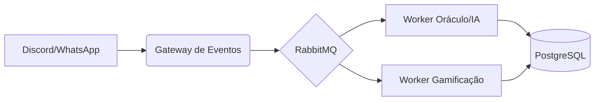

# Bot-XP-Discord

### Atualizações futuras
- [x] Adição de xp
- [x] Adição automatica de cargo
- [x] Listagem de hierarquia entre os clubistas
- [ ] Teste de código para dar pontos ao usuário caso comprovado que funciona
- [ ] Notificicação de novo cargo ou de adição de xp


## Na sua máquina
Para testar, use um ambiente virtual
```
python3 -m venv venv
```
```
source venv/bin/activate
```
```
pip install -r requirements.txt
```

# 🦉 Deusa Athena | Inteligência Central TYTO.club

**Athena** é a assistente inteligente e oráculo do TYTO.club. Mais do que um bot, ela é o motor de engajamento que sustenta a comunidade, gerenciando desde a economia interna (tokens e XP) até o suporte técnico e mentoria de código em tempo real.

## 🏛️ Sobre o Oráculo

Athena foi concebida para centralizar a jornada do "clubista" dentro do ecossistema TYTO. Ela atua em múltiplas frentes para garantir que o aprendizado seja fluido, gamificado e produtivo.

### 🌟 Funcionalidades Principais

* **🎮 Gamificação Integrada:** Gerenciamento automatizado de pontos de experiência (XP) e tokens do clube baseados em participação e entregas.
* **🤖 Oráculo (Suporte AI):** Respostas instantâneas a dúvidas dos membros, utilizando RAG (Retrieval-Augmented Generation) para contexto específico do clube.
* **💻 Mentor de Código:** Avaliação inteligente de submissões de código, oferecendo feedback construtivo e propondo desafios práticos.
* **📅 Mestra do Fluxo:** Automação de tarefas, agendamento de reuniões e gestão de cargos nos servidores do Discord e WhatsApp.
* **🚀 Desafios Dinâmicos:** Proposição de desafios técnicos semanais com correção automática e atribuição de recompensas.


## 🛠️ Stack Tecnológica

* **Linguagem:** TypeScript / Node.js
* **Integrações de Chat:** Discord.js & Whatsapp-web.js
* **Inteligência Artificial:** OpenAI API (GPT-4o) para processamento de linguagem e análise de código.
* **Banco de Dados:** PostgreSQL (Persistência) & Redis (Cache de estados da gamificação).
* **Mensageria:** RabbitMQ para processamento assíncrono de eventos e tarefas pesadas.
* **Infraestrutura:** Docker & Portainer.


## 🏗️ Arquitetura de Alto Nível

O sistema opera em uma arquitetura orientada a eventos, garantindo que as interações em múltiplas plataformas não sobrecarreguem o núcleo de processamento de IA.




## 🚀 Como Contribuir

Athena é o coração tecnológico do clube. Para contribuir:

1. Verifique a lista de **Issues** para desafios de código abertos.
2. Siga as convenções de commit e padrões de código TypeScript.
3. Submeta um PR e aguarde a própria Athena avaliar sua solução!


> *"No TYTO.club, a sabedoria é a moeda, e Athena é quem garante que o cofre nunca fique vazio."*

